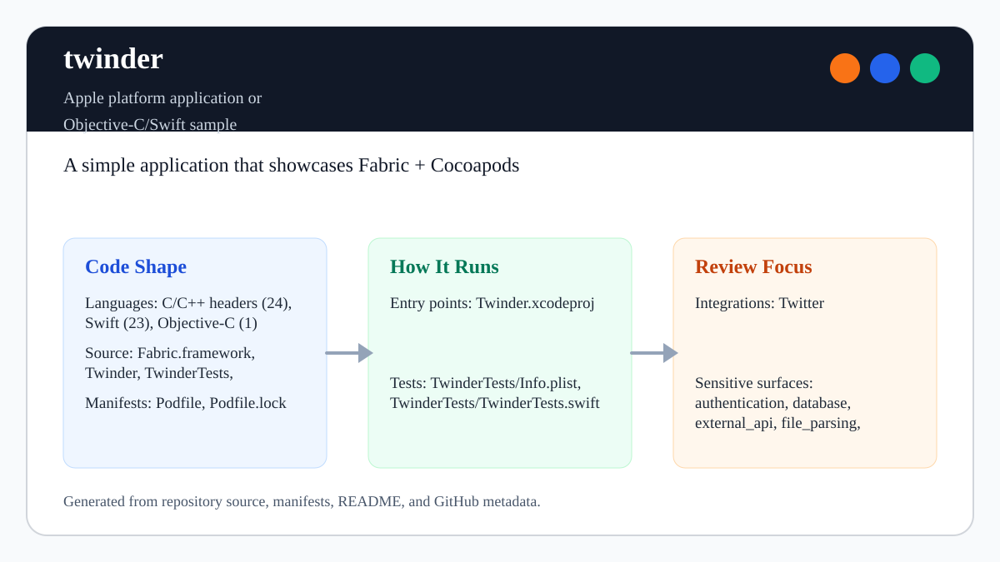

# twinder

<!-- README-OVERVIEW-IMAGE -->


## Overview

`garethpaul/twinder` is an Apple platform application or Objective-C/Swift sample. A simple application that showcases Fabric + Cocoapods

This README is based on the checked-in source, manifests, scripts, and repository metadata on the `master` branch. The project language mix found during review was: C/C++ headers (24), Swift (23), Objective-C (1).

## Repository Contents

- `README.md` - project overview and local usage notes
- `Podfile` - Apple platform dependency metadata
- `Fabric.framework` - source or example code
- `Podfile.lock` - Apple platform dependency metadata
- `SECURITY.md` - security reporting and disclosure guidance
- `Twinder` - source or example code
- `Twinder.xcodeproj` - Xcode project file
- `TwinderTests` - source or example code
- `TwitterKit.framework` - source or example code
- `VISION.md` - project direction and maintenance guardrails

Additional scan context:

- Source directories: Fabric.framework, Twinder, TwinderTests, TwitterKit.framework
- Dependency and build manifests: Podfile, Podfile.lock
- Entry points or build surfaces: Twinder.xcodeproj
- Test-looking files: TwinderTests/Info.plist, TwinderTests/TwinderTests.swift

## Getting Started

### Prerequisites

- Git
- macOS with a historical Xcode/Swift toolchain for any native build attempt
- CocoaPods 0.35.0 if the locked dependencies must be reproduced

### Legacy Toolchain Boundary

- The Xcode project uses the Xcode 3.2-compatible project format and records
  iOS deployment targets 8.0 and 8.2.
- `Podfile.lock` pins CocoaPods 0.35.0 and MDCSwipeToChoose 0.2.1.
- The repository vendors TwitterKit 1.2.0 and Fabric 1.1.1 frameworks.
- The Swift source uses a pre-modern language dialect. Current Xcode may require
  a dedicated migration before it can compile the project.
- TwitterKit, Fabric, and their service dependencies are retired. A native
  build does not prove that login, API, deep-link, or timeline behavior still
  works against current services.

The checked-in Xcode project, `Podfile.lock`, and framework metadata are the
sources of truth for this historical boundary. Do not add credentials while
attempting reproduction.

### Setup

```bash
git clone https://github.com/garethpaul/twinder.git
cd twinder
pod install
```

The setup commands above are derived from repository files. Legacy mobile, Python, or JavaScript samples may require older SDKs or package versions than a modern workstation uses by default.

## Running or Using the Project

- Open `Twinder.xcodeproj` in Xcode, choose the app or sample scheme, and run it on the matching simulator/device.
- Run `make check` for static project and Twitter API parsing checks. The build
  step runs the native build only with the compatible Xcode 6 toolchain; modern
  Xcode releases report the documented legacy skip instead of attempting an
  unsupported Swift migration. The checked-in bridge header path is relative
  to the repository rather than an individual developer home directory.
- Run `make root-test` to verify the local Make boundary from external and
  hostile paths. Public aliases reject later recipe replacement and embed the
  reviewed repository root and Python command before later non-override target
  variables can redirect them. They also pin `/bin/sh -c` against later
  non-override shell assignments and use `/usr/bin/xcodebuild` directly.
  Caller-supplied Make programs using GNU Make `override` directives remain
  outside the local trust boundary. GNU Make startup files are parsed before
  repository checks, so startup code is also outside the local trust boundary.
  absolute Python executable selection defaults to `/usr/bin/python3`, is baked
  into recipes, and runs with isolated Python startup (`-I -B`) so `PATH`,
  `PYTHONPATH`, user-site packages, and `sitecustomize.py` cannot replace checks.

## Testing and Verification

- `make check` runs plist, storyboard, asset, CocoaPods lock, Twitter API JSON
  parsing, profile-image loading, current-user profile image loading,
  current-user profile image failure completion, swipe-card remote-data,
  timeline tweet completion, initial swipe-card data, friends-list session,
  friends-list response data, login session, saved-profile context,
  saved-profile write transactions, and Core Data failure-path contract checks.
- Shared profile image downloads require HTTPS, run through cancellable
  URLSession tasks off the main queue, time
  out after 15 seconds, and reject non-success, non-image, oversized, or
  undecodable responses before returning to UI code on the main queue.
- Saved-profile rows clear reused images and verify that asynchronous image
  results still belong to the row before updating the cell.
- Reused saved-profile cells cancel obsolete image tasks and reject stale
  completions.
- Reused saved-profile cells remove their owned name and border overlays before
  reconfiguration instead of accumulating duplicate subviews.
- Saved-profile selection validates table identity before opening Twitter.
- Saved-profile writes persist before publishing success. Missing Core Data
  contexts and failed saves leave both durable and in-memory favorites
  unchanged. Each insertion uses an isolated context and rollback, while
  optional legacy fields are bound before table use.
- Swipe cards clear old profile images, weakly capture the card during image
  loading, and verify the requested URL still belongs to the current profile
  before applying a late completion. Replacement loads and released cards
  cancel their active task, and request generations reject older same-URL
  completions.
- Embedded tweet lookups weakly capture swipe cards, invalidate callbacks when
  cards leave the window, verify request/profile identity, and add tweet UI on
  the main queue.
- Twitter profile deep links encode the screen name as a query item, avoid URL
  force unwraps, reject handles outside the 1-15 character ASCII Twitter
  alphabet, and open only when iOS accepts the constructed route.
- Completed maintenance plans live under `docs/plans` and are checked by
  `make check`.
- GitHub Actions runs `/usr/bin/make check` on Python 3.10, 3.12, and 3.14
  on Ubuntu 24.04 with read-only permissions, credential-free checkout, and
  immutable action pins. Exact-text mutation checks reject custom shell,
  environment, step, command, line-wrapping, and non-read-only permission
  changes to the reviewed workflow shape. A required base-owned
  `pull_request_target` gate fetches the candidate workflow only as inert data,
  compares it to the reviewed byte contract, and rejects candidate changes to
  its own workflow or policy. Trusted-policy updates require a separate
  base-maintenance path rather than candidate execution.
- Xcode's test action or `xcodebuild test` with the appropriate scheme and destination on macOS

When the required SDK or runtime is unavailable, use static checks and source review first, then verify on a machine that has the matching platform toolchain.

## Configuration and Secrets

- Detected references to Twitter. Keep API keys, OAuth credentials, tokens, and account-specific values in local configuration only.

## Security and Privacy Notes

- Review changes touching authentication or token handling; examples from the scan include Twinder/API.swift, Twinder/AppDelegate.swift, Twinder/LoginController.swift, Twinder/PersonController.swift, and 6 more.
- Review changes touching external API calls or credential-adjacent configuration; examples from the scan include Fabric.framework/Versions/A/Headers/Fabric.h, Fabric.framework/Versions/A/Resources/Info.plist, Twinder/API.swift, Twinder/AppDelegate.swift, and 6 more.
- Review changes touching network requests, sockets, or service endpoints; examples from the scan include Fabric.framework/Versions/A/Resources/Info.plist, Twinder/API.swift, Twinder/Info.plist, Twinder/TweepPicture.swift, and 6 more.
- Review changes touching mobile permissions or privacy-sensitive device data; examples from the scan include TwitterKit.framework/Versions/A/Headers/TWTRConstants.h.
- Review changes touching file, media, JSON, XML, CSV, OCR, or data parsing; examples from the scan include Fabric.framework/Versions/A/Resources/Info.plist, Twinder/API.swift, Twinder/Info.plist, Twinder/PersonController.swift, and 6 more.
- Review changes touching database, model, or persistence code; examples from the scan include Twinder/AppDelegate.swift, TwitterKit.framework/Versions/A/Headers/TWTRTweetTableViewCell.h, TwitterKit.framework/Versions/A/Headers/TWTRTweetViewDelegate.h.

## Maintenance Notes

- This looks like an Apple platform project or sample. Xcode, Swift, CocoaPods, and deployment target versions may need to match the original project era.
- See `SECURITY.md` for vulnerability reporting and safe research guidance.
- See `VISION.md` for project direction and contribution guardrails.
- See `docs/plans/2026-06-08-twinder-baseline.md` for the current static
  verification baseline.
- See `docs/plans/2026-06-08-profile-image-loading-guards.md` for profile-card
  image URL and decode guard coverage.
- See `docs/plans/2026-06-09-person-profile-image-guards.md` for current-user
  profile image loading guard coverage.
- See `docs/plans/2026-06-08-core-data-failure-guards.md` for non-crashing
  Core Data failure-path coverage.
- See `docs/plans/2026-06-09-swipe-card-remote-data-guards.md` for swipe-card
  remote profile and tweet rendering guard coverage.
- See `docs/plans/2026-06-09-initial-card-data-guards.md` for initial and
  replenished swipe-card data guard coverage.
- See `docs/plans/2026-06-09-login-session-guard.md` for TwitterKit login
  navigation guard coverage without logging auth details.
- See `docs/plans/2026-06-09-api-session-guard.md` for friends-list session
  guard coverage.
- See `docs/plans/2026-06-09-friends-list-data-guard.md` for friends-list
  response data and username logging guard coverage.
- See `docs/plans/2026-06-09-tweep-picture-failure-completion.md` for
  current-user profile image failure completion coverage.
- See `docs/plans/2026-06-09-timeline-tweet-failure-completion.md` for
  swipe-card timeline tweet failure completion coverage.
- See `docs/plans/2026-06-09-timeline-tweet-completion.md` for embedded
  timeline tweet lookup completion coverage.
- See `docs/plans/2026-06-10-ci-baseline.md` for the hosted static contract
  baseline.
- See `docs/plans/2026-06-10-profile-image-transport.md` for the completed
  profile image transport hardening.
- See `docs/plans/2026-06-10-table-image-reuse.md` for saved-profile table
  image reuse guard coverage.
- See `docs/plans/2026-06-12-saved-profile-context-guard.md` for the guarded
  saved-profile Core Data fetch fallback.
- See `docs/plans/2026-06-13-swipe-card-image-identity.md` for weak and
  identity-checked swipe-card image completions.
- See `docs/plans/2026-06-13-swipe-card-image-cancellation.md` for cancellable
  swipe-card image tasks and same-URL generation guards.
- See `docs/plans/2026-06-13-safe-twitter-deep-link.md` for encoded,
  fail-closed Twitter profile routing.
- See `docs/plans/2026-06-14-legacy-setup-notes.md` for the historical Xcode,
  CocoaPods, TwitterKit, Fabric, and Swift compatibility boundary.
- See `docs/plans/2026-06-21-make-authority-isolation.md` for the narrowed local
  Make authority boundary and its caller-program exclusions.
- See `docs/plans/2026-06-25-tweet-embed-lifecycle.md` for swipe-card embedded
  tweet callback ownership and detached-card invalidation.

## Contributing

Keep changes small and tied to the project that is already present in this repository. For code changes, document the toolchain used, avoid committing generated dependency directories or local configuration, and update this README when setup or verification steps change.
